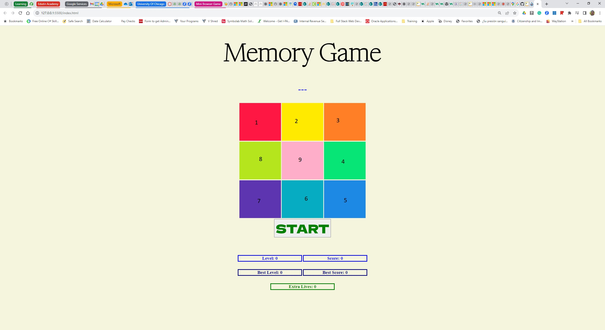

# Welcome to my Memory Game!

Hi! This game is based on the popular game called 'Memory Game' from the 'Fabulous Fred' device from Megacorp
Fabulous Fred was a very popular toy in the 80's. Its interfase was so simple and colored. Without the technology we have today, it kept us busy playing several games including 'Memory Game' for hours. You can find more info by clicking =>
[Mego Corp Wiki](https://commons.wikimedia.org/wiki/File:Fabulous_Fred_by_Mego_Corporation,_Made_In_Japan,_Copyright_1980_(Electronic_Handheld_Game)_Choice_Of_9_Games.jpg)

## How to Play the game
As mentioned before, the interfase was so simple it just required to focus and use our memory.
The game consists of a keyboard with nine buttons 1-9 numbered (not shown) clock wise. The goal is to 'click' the buttons on the same sequence as the computer does by taking turns.

- The game starts when the users clicks the 'Start' button
- The game launches a five seconds timer and warns the user to 'get ready' to start following the pattern.
- The computer will display a random button from the nine available on the keyboard then it will wait for the user to click the same button.
- Once the user clicks the same button as the computer, the computer will repeat the sequence and add one random button to the 'queue' of colors to play. The game will continue with both the user and the computer taking turns.

## Levels
The game consists of 10 levels with level 9 being the last playable level and level 10 being the 'Winner' level. Take it as an 'Exclusive' Club for winners only. The computer displays the current level in the bottom of the page and will inform the user in what level they are playing. Levels are as follows:

- Level:  1, Description:  '💤 Easy 💤'
- Level:  2, Description:  '😊 Beginner 😊'
- Level:  3, Description:  '😁 Intermediate 😁'
- Level:  4, Description:  '😎 Expert 😎'
- Level:  5, Description:  '🧐 Senior 🧐'
- Level:  6, Description:  '😨 I N S A N E!! 😨'
- Level:  7, Description:  '😱 C R A Z Y!! 😱'
- Level:  8, Description:  '🤓 EINSTEIN! 🤓'
- Level:  9, Description:  '🚀 OUT OF THIS WORLD!'

## Progress and Extra Lives
Since every level gets more difficult every time by the computer speeding its turn and displaying the colors for less than a second, an extra life is granted every time a new level starts.
An extra life is given based on the following:
- First level, one color played
- Second level, three colors played
- Third level, seven colors played
- Fourth level......you will have to play the game to find out more.

## Winning the game
To win the game, the user will have to beat Level 9 then a legend will display the user won the game. You will have to play the game to discover such 'prize'

## Losing the game
You lose your turn/game by clicking the wrong sequence of buttons. Depending on how many extra lives you have under your belt. You will lose the game if no extra lives are left or one life will be deducted from your extra lives bag and the game will continue until you win...or lose.

## Resources
All images are copyright by the respective owners. Credits below
[Wikipedia Commons](https://commons.wikimedia.org/wiki/File:Fabulous_Fred_by_Mego_Corporation,_Made_In_Japan,_Copyright_1980_%28Electronic_Handheld_Game%29_Choice_Of_9_Games.jpg)

Credits for Sounds, animations and music from the following websites

- [Kirupa - Playing a randonly Generated Sound](https://www.kirupa.com/html5/randomly_generated_sound_web_audio_api.htm)
- [Enton Biba - Play DoReMiFaSo](https://www.entonbiba.com/codes/play-do-re-mi-fa-so-song-with-web-audio)

Grid taken from Activity 8 from the course JavaScript
[GameOver Image](https://pngimg.com/image/83375)

Documentation to the JavaScript language from the mozilla developers website and W3schools
https://developer.mozilla.org/en-US/docs/Web/HTML
https://developer.mozilla.org/en-US/docs/Web/CSS
https://developer.mozilla.org/en-US/docs/Web/JavaScript
https://www.w3schools.com/css/css3_variables_javascript.asp

##  Log
- 09/28/2023. Major enhancements to sounds and implemented the code that allows taking turns between the user and the computer.
- 10/01/2023. Game runs as expected excep there should be a delay when pc is playing;
- 10/01/2023. Refactored the code. Game performs as expected. See credits on the styles.css file.
- 10/03/2023. After the game is over the words 'Game Over' are intermitently displayed in the center of the keyboard
- 10/03/2023. Added a timer at the beginning of a new game
- 10/05/2023. Added smiley faces per level plus other features as increasing game speed as the game progresses.
- 10/06/2023. User is awarded an extra life at the beginning of a new level.